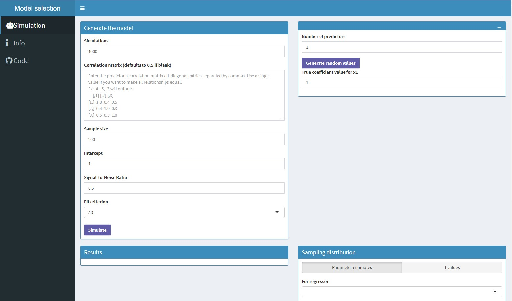

```{r setup, include=FALSE}
options(htmltools.dir.version = FALSE)
knitr::opts_chunk$set(
	echo = FALSE,
	fig.align = "center",
	fig.height = 4,
	fig.retina = 3,
	fig.width = 9,
	message = FALSE,
	warning = FALSE,
	cache = FALSE,
	hiline = TRUE,
	out.width = "100%"
)
```

```{r xaringan-themer, include=FALSE, warning=FALSE}
library(xaringanthemer)
library(xaringanExtra)
library(dplyr)
library(ggplot2)
library(kableExtra)
library(patchwork)

style_duo_accent(
  title_slide_background_color ="#FFFFFF",
  title_slide_text_color = "#024F84",
  primary_color = "#024F84",
  secondary_color = "#FF961C",
  inverse_header_color = "#FFFFFF",
  text_color = "#515151",
  text_font_size = "1.4rem",
  text_slide_number_color = "#FFFFFF",
  table_row_even_background_color = "#D6EAF8"# "#a1c7cf",
)
```

```{r xaringan-extra-styles}
xaringanExtra::use_extra_styles(
  hover_code_line = TRUE,         #<<
  mute_unhighlighted_code = FALSE  #<<
)
```

```{r xaringanExtra, echo = FALSE}
xaringanExtra::use_progress_bar(color = "#c31919", location = "top")
xaringanExtra::use_scribble()
xaringanExtra::use_panelset()

```

```{r xaringan-logo, echo=FALSE}
xaringanExtra::use_logo(
  image_url = c("img/logo.png"),
  # width = "365px",
  # height = "79px",
  position = css_position(top = "1em", right = "3em"),
  exclude_class = c("my-title", "inverse", "hide_logo")
)
```

# Introduction

Much of the current research questions on behavioral and social sciences are investigated using statistical models.

Researchers who have a vague idea of the right model to answer their research questions and engage in a "data mining" process.

To determine which variables should be included in the model, a common solution is to resort to variable selection algorithms.

Often, the final model obtained through variable selection is interpreted as if it were prespecified.

---
# Why is it a problem?

The estimated results can be highly biased when the correct model is unknown prior to data analysis, and the same data set is used for:

1. variable selection; 
2. parameter estimation; 
3. statistical inferences

These procedures discards parameter estimates from the model, and the sampling distribution of the remaining regression parameters estimates gets distorted

---

In a multiple regression we estimate *partial regression coefficients*

\begin{equation}
y_i = b_0 + b_1x_1 + b_2x_2 + \varepsilon
\end{equation}

The regression coefficient for $x_i$, is model dependent:

\begin{equation}
b_1 = \frac{r_{yx_1} - r_{yx_2}r_{x_1x_2}}{(1 - r_{x_1x_2}^2)} \times \frac{\sigma_y}{\sigma_{x_1}}
\end{equation}

\begin{equation}
b_2 = \frac{r_{yx_2} - r_{yx_1}r_{x_2x_1}}{(1 - r_{x_2x_1}^2)} \times \frac{\sigma_y}{\sigma_{x_2}}
\end{equation}

Unless we have uncorrelated predictors (i.e. $r_{x_1x_2}$ = 0), the value for any of the regression coefficients is determined by which other predictors are in the model:

\begin{equation}
b_1 = \frac{r_{yx_1} - r_{yx_2} \times 0}{(1 - 0^2)} \times \frac{\sigma_y}{\sigma_{x_1}} = r_{yx_1} \times \frac{\sigma_y}{\sigma_{x_1}}
\end{equation}

---

# Example 1

Consider a model for a response variable $y$ with two potential regressors, $x$ and $z$. Say we are interested in the relationship between $y$ and $x$ while holding $z$ constant, that is, $\hat{\beta}_{yx\cdot z}$

\begin{equation}
y_i = \beta_0 + \beta_1x_i + \beta_2z_i + \varepsilon_i
\end{equation}

```{r ex1, echo=TRUE}
reps <-  1000
p <- 2 # number of predictors
Sigma <- matrix(.5, p, p) # correlation matrix
diag(Sigma) <- 1
n <-  250 # sample size
b0 <- 0 # intercept (can be set to any value)
betas <- rep(1, 2) 
error <- rnorm(n, 0, sqrt(10))
coefs_a <- cover <- matrix(0, nrow = reps, ncol = 2) # defining the matrices to store simulation results

```

---

.panelset[
.panel[.panel-name[Code]

```{r ex1a, echo=TRUE}
for (i in seq(reps)) {
  # X is a matrix of regression coefficients
  X <-  MASS::mvrnorm(n = n, rep(0, 2) , Sigma)
  # with the values randomly drawn in X, we'll estimate values for y
  y <- as.numeric(cbind(1, X) %*% c(b0, betas) + error)
  Xy <- as.data.frame( cbind(X, y))
  colnames(Xy) <- c(c("x", "z"), "y")
  # fit a linear model with x and z to predict y
  fit <- lm(y ~ ., data = Xy)
  coefs_a[i, ] <- coef(fit)[-1] # save the regression coefficients
  cis <- confint(fit)[-1,] # save the 95% CIs
  # if the true value is capture by the CI, sum 1, 0 otherwise 
  cover[i,] <- ifelse(cis[,1] < 1 & cis[,2] > 1, 1, 0)
}
colnames(coefs_a) <- c("x", "z")
coefs_a <- as.data.frame(coefs_a)
bias <- coefs_a - betas
```

]
.panel[.panel-name[Results]

```{r res1a}
tibble::tibble(
  Predictor = c("x", "z"),
  Coverage = colMeans(cover),
  Bias = colMeans(coefs_a - betas)
) |> 
  knitr::kable(format = "html")
```

```{r plot-ex1a, out.width="70%"}

ggplot(data = coefs_a, aes(x = x)) +
  geom_histogram(color = "black", fill = "white", bins = 30) +
  theme_classic(14) +
  theme(axis.title.y=element_blank(),
        axis.text.y=element_blank(), 
        axis.ticks.y=element_blank(),
        axis.line.y = element_blank()) +
  xlab( expression(paste("Values of ", beta[yx.z])))
```
]
]
---

```{r ex1b-pre}
p <- 2
Sigma <- matrix(.5, p, p)
diag(Sigma) <- 1
n = 250
b0 <- 0
betas <- rep(1, 2)
reps = 1000
coefs_b <- cover <- matrix(NA, nrow = reps, ncol = 2)
```

.panelset[
.panel[.panel-name[Code]
```{r ex1b, echo=TRUE}
for (i in seq(reps)) {
  X <-  MASS::mvrnorm(n = n, rep(0, 2) , Sigma)
  y <- as.numeric(cbind(1, X) %*% c(b0, betas) + rnorm(n, 0, sqrt(10)))
  Xy <- as.data.frame( cbind(X, y))
  colnames(Xy) <- c(c("x", "z"), "y")
  fit <- lm(y ~ x, data = Xy) #<<
  coefs_b[i, ] <- coef(fit)[-1]
  cis <- confint(fit)[-1,]
  cover[i,] <- ifelse(cis[1] < 1 & cis[2] > 1, 1, 0)
}
colnames(coefs_b) <- c("x", "z")
coefs_b <- as.data.frame(coefs_b)
```
]
.panel[.panel-name[Results]

```{r res1b}
tibble::tibble(
  Predictor = c("x"),
  Coverage = colMeans(cover)[1],
  Bias = colMeans((coefs_b - betas)^2)[1]
) |> 
  knitr::kable(format = "html")
```

```{r plot-ex1b, out.width="70%"}

ggplot(data = coefs_b, aes(x = x)) +
  geom_histogram(color = "black", fill = "white", bins = 30) +
  theme_classic(14) +
  theme(axis.title.y=element_blank(),
        axis.text.y=element_blank(), 
        axis.ticks.y=element_blank(),
        axis.line.y = element_blank())+
  xlab( expression(paste("Values of ", beta[yx])))
```
]
]
---
class:middle

.pull-left[

Estimating model parameters in the same single random sample used to find an appropriate model isn’t a good idea.

Discarding $z$ from our model has distorted the sampling distribution of $x$.

> "When a single model is not specified before the analysis begins, it is not clear what population parameter is the subject of study. And without this clarity, the reasoning behind statistical inference becomes obscure". (Berk et al., 2010)

]

.pull-right[


```{r fig.height=7, fig.retina=4}
dplyr::bind_rows("full" = coefs_a, "subset" = coefs_b, .id = "group") |> 
  ggplot(aes(x, fill = group, color = group)) +
  geom_density(adjust = 2, alpha = 0.4) +
  theme_minimal(14) +
  theme(legend.position = "top",#c(.9, .7),
        axis.title.y = element_blank(),
        axis.text.y = element_blank(),
        legend.text = element_text(size=14)) +
  #scale_y_continuous(limits = c(0, 0.55)) +
  scale_color_manual(name = NULL,
                      labels = c(expression(beta[yx.z]), expression(beta[yx])),
                      values = c("red3", "dodgerblue3")) +
  scale_fill_manual(name = NULL,
                      labels = c(expression(beta[yx.z]), expression(beta[yx])),
                      values = c("red3", "dodgerblue3")) +
  labs(x = "Estimates for x")
```

]
---

# Known issues

.v-center[

\begin{equation}
SE(\hat{\beta}_{yx\cdot z}) = \frac{\hat{\sigma_{\varepsilon}}}{s_x \sqrt{n-1}}\sqrt{\frac{1}{1-r^2_{xz}}} 
\end{equation}

- Collinearity

- Noise: $\frac{S}{N} = \textbf{b}\Sigma\textbf{b}\sigma_{\varepsilon}^{-2}$

- Sample size (n)

- Number of candidate predictor variables (p)
]
---
class: scrollable-slide

```{r multi-function, echo=TRUE}
sim_bias_multi <- function(reps, p, n, SNR, b, corr) {
  
  
  Sigma <- matrix(corr, p, p)
  diag(Sigma) <- 1
  beta <- rep(b, p)
  names(beta) <- paste0("x", 1:p)
  b0 <- 1
  sigma_error <-  sqrt(as.numeric(crossprod(beta, Sigma %*% beta) / SNR))
  
  rsq <- NULL
  coefs <- tvals <- matrix(NA, nrow = reps, ncol = p)
  cover <- matrix(0, nrow = reps, ncol = p)
  colnames(coefs) <- paste0("x", 1:p)
  colnames(cover) <- paste0("x", 1:p)
  colnames(tvals) <- paste0("x", 1:p)
  
  for (i in seq(reps)) {
    
    X <-  MASS::mvrnorm(n = n, rep(0, p) , Sigma)
    y <- as.numeric(cbind(1, X) %*% c(b0, beta) + rnorm(n, 0, sigma_error))
    Xy <- as.data.frame( cbind(X, y))
    colnames(Xy) <- c(paste0("x", 1:p), "y")
    fit <- lm(y ~., data = Xy)
    sel <- step(fit, k = 2, trace = FALSE)
    s <- summary(sel)
    tval <- s$coefficients[,3][-1]
    tvals[i, names(tval)] <-  tval
    coefs[i, names(tval)] <- coef(sel)[-1]
    rsq[i] <- s$r.squared
    cis <- confint(sel)[-1,]
    if (length(cis) < 3) {
      cover[i,names(tval)] <- ifelse(cis[1] < beta[names(tval)] & 
                                       cis[2] > beta[names(tval)], 1, 0)
    } else {
      cover[i,names(tval)] <- ifelse(cis[names(tval),1] < beta[names(tval)] & 
                                       cis[names(tval),2] > beta[names(tval)], 
                                     1, 0)
    }
    
  }
  
  res <- list(coefs = coefs, tvals = tvals, cover = cover, 
              bias = coefs - beta, mse = (coefs - beta)^2, rsq = rsq, 
              corr = corr, p = p)
  
  res

}


```
---

```{r eval=TRUE, include=FALSE}

sim_summary <- function(l) {
  
  df <- tibble::tibble(
    
    cor = l$corr,
    npred = l$p,
    predictor = colnames(l$cover),
    coverage = colMeans(l$cover),
    estimate = colMeans(l$coefs, na.rm = TRUE),
    bias = colMeans((l$coefs - 1), na.rm = TRUE),
    mse = colMeans((l$coefs - 1)^2, na.rm = TRUE),
    rsq = mean(l$rsq)
    
  )
  df
  
}

sims <- lapply(paste0("G:/Documentos/ProjetosR/marwincarmo.github.io/sims_model_bias/", list.files("G:/Documentos/ProjetosR/marwincarmo.github.io/sims_model_bias")), readRDS)
simdf <- purrr::map_dfr(sims, sim_summary)

simdfplot <- simdf |> 
  dplyr::group_by(cor, npred) |> 
  dplyr::summarise(
                   coverage = mean(coverage),
                   estimate = mean(estimate),
                   bias = mean(bias),
                   mse = mean(mse),
                   rsq = mean(rsq)) |> 
  dplyr::ungroup()
```

```{r sim-multi, eval=FALSE, echo=TRUE}

sims <- furrr::future_map(seq(2, 10), 
                          ~furrr::future_pmap(
                            list(
                              reps = 1000, p = .x, n = 100, SNR = 0.5, 1, 
                              corr = seq(0.1, 0.9, by = 0.1)), sim_bias_multi))

```

```{r simplots, fig.retina = 3, out.width="80%"}
simdfplot |> 
  dplyr::mutate(dplyr::across(c("coverage", "bias", "mse", "rsq"), scale)) |> 
  tidyr::pivot_longer(cols = c(coverage, bias, mse, rsq), names_to = "measure", values_to = 'value') |> 
  dplyr::mutate(measure = dplyr::recode(measure, "coverage" = "Coverage", "bias" = "Bias", "mse" = "MSE", "rsq" = "R^2")) |>
  ggplot() +
  aes(x = cor, y = npred, fill = value) +
  geom_tile() +
  scale_fill_viridis_c(direction = -1, option = "inferno", alpha = .9) +
  scale_y_continuous(breaks = c(2, 4, 6, 8, 10)) +
  labs(x = latex2exp::TeX("$\\rho$"), y = "p", fill = "SD") +
  theme_minimal(12) +
  facet_wrap(~measure, scales = "free", 
             labeller = label_parsed)
```

---
# To the app

https://marwin.shinyapps.io/model-selection-app/

<a href="https://marwin.shinyapps.io/model-selection-app/">
   
</a>

---
# Conclusion
.v-center[
- We identified specific characteristics of the data generating model that can potentially increase the bias in estimates obtained through variable selection.

- Post-model-selection sampling distribution can deviate greatly from the assumed underlying distribution.

- Potential solutions:
  - Derive a theoretically based appropriate model 
  - Cross-validation (training and test sample)
  - Differentiate between confirmatory and exploratory analysis
]

---

# References
.small[
Berk, R. (2010). What you can and can’t properly do with regression. *Journal of Quantitative Criminology, 26*(4), 481–487. https://doi.org/10.1007/s10940-010-9116-4

Berk, R., Brown, L., Buja, A., Zhang, K., & Zhao, L. (2013). Valid post-selection inference. *The Annals of Statistics, 41*(2), 802–837. https://doi.org/10.1214/12-AOS1077

Berk, R., Brown, L., & Zhao, L. (2010). Statistical Inference After Model Selection. *Journal of Quantitative Criminology, 26*(2), 217–236. https://doi.org/10.1007/s10940-009-9077-7

Cohen, J., & Cohen, P. (1983). *Applied Multiple Regression/Correlation Analysis for the Behavioral Sciences* (2nd ed.).

Harrell, F. E. (2001). *Regression modeling strategies: With applications to linear models, logistic regression, and survival analysis*. Springer-Verlag, New York.

Lukacs, P. M., Burnham, K. P., & Anderson, D. R. (2009). Model selection bias and Freedman's paradox. *Annals of the Institute of Statistical Mathematics, 62*(1), 117. https://doi.org/10.1007/s10463-009-0234-4
]
---
# Thank you

.pull-left[
Contact:
  - Email: [marwin@usp.br](mailto:marwin@usp.br)
  - Webpage: [https://marwincarmo.github.io/](https://marwincarmo.github.io/)
  - Github: [marwincarmo](https://github.com/marwincarmo)
  - Twitter: [marwincarmo](https://twitter.com/marwincarmo)
  - Linkedin: [Marwin Carmo](https://www.linkedin.com/in/marwin-carmo/)

This presentation was created using `xaringanthemer` package for R. Code available at https://github.com/marwincarmo/conferences/tree/main/vi-ser
]

.pull-right[
<center>
Access the slides at

```{r out.width="70%", dpi=300}

```


<a href="https://bit.ly/ser-selbias">bit.ly/ser-selbias</a>

</center>
]